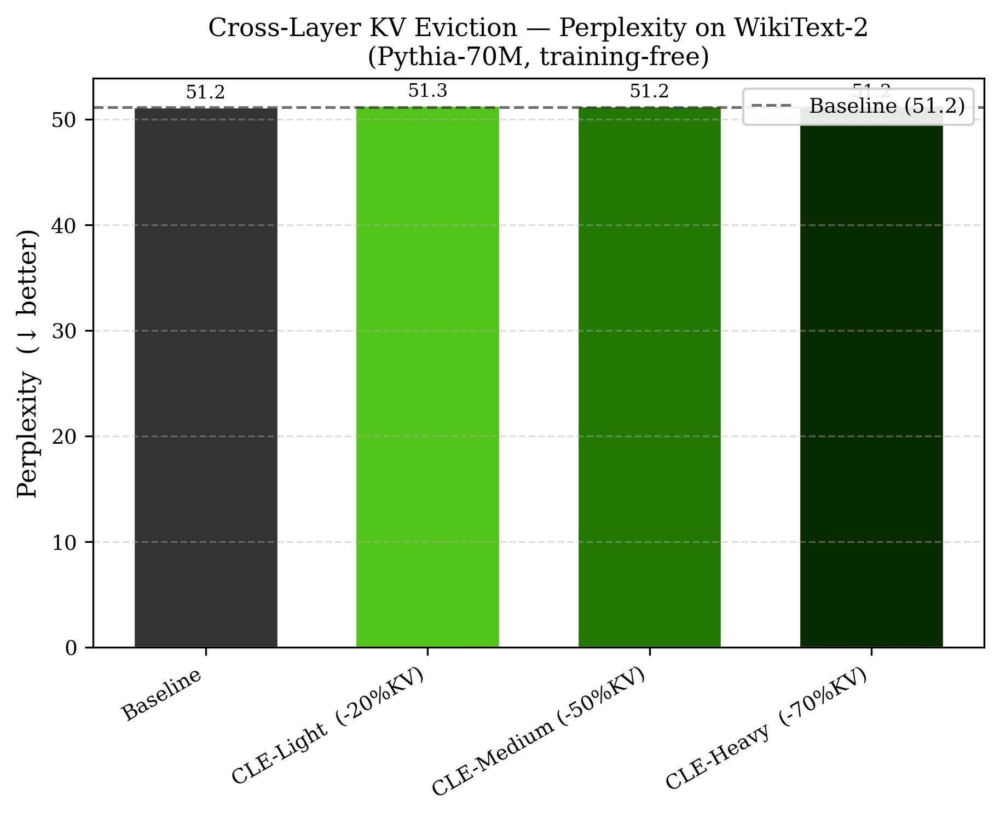
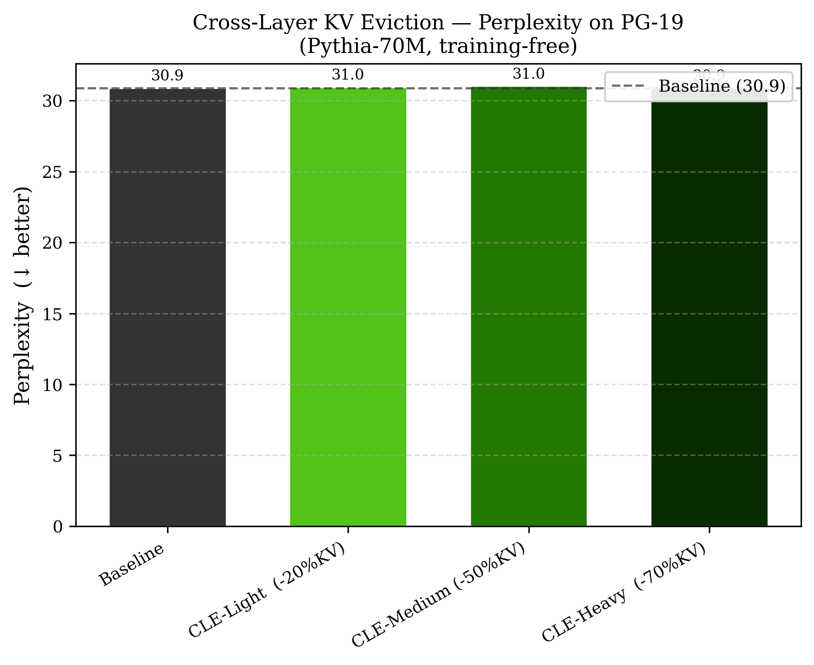
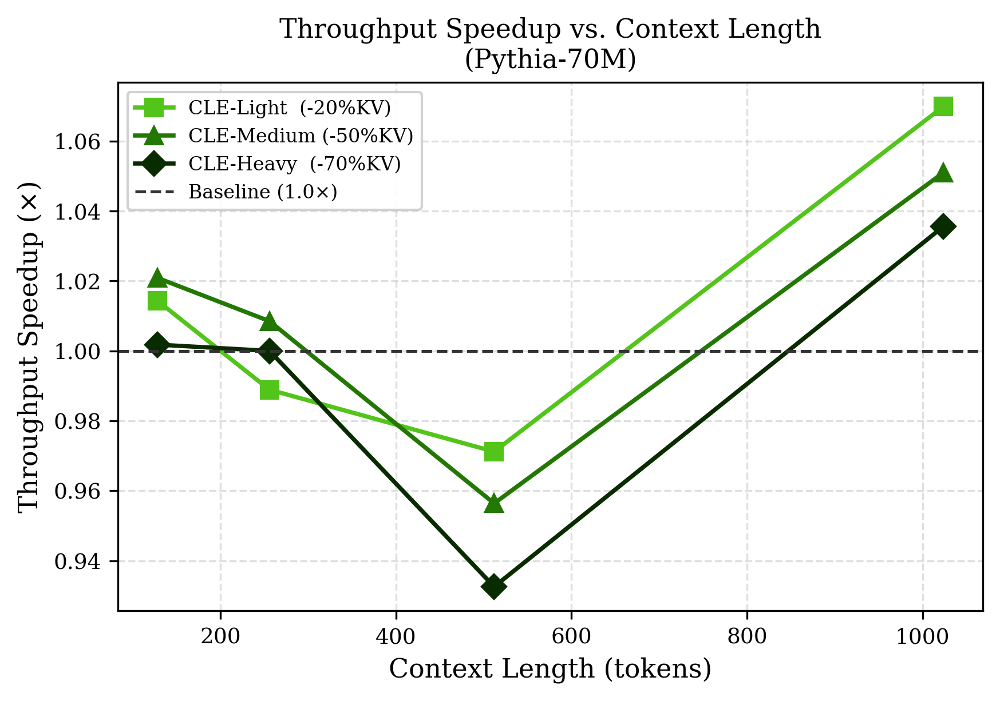
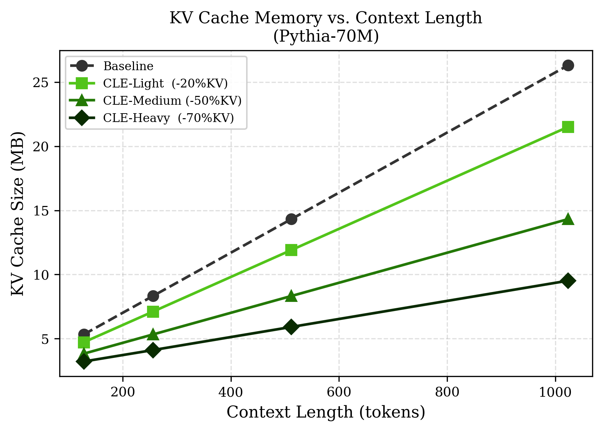
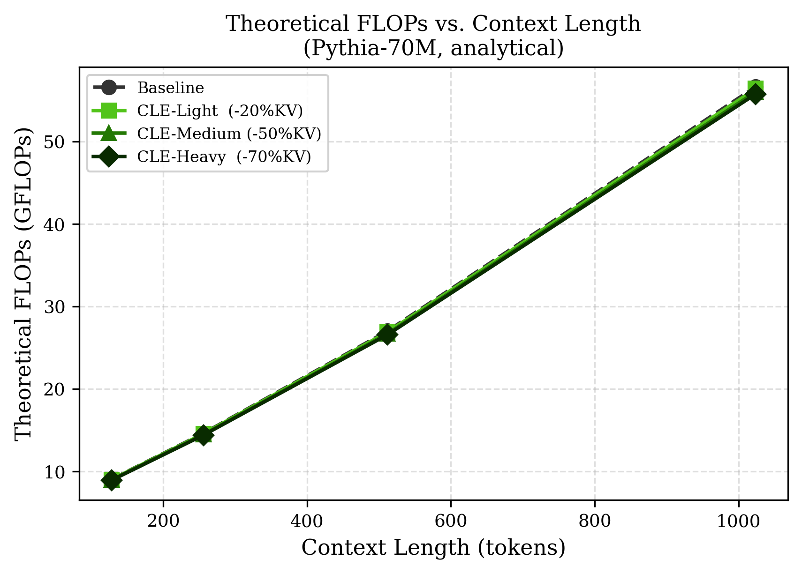
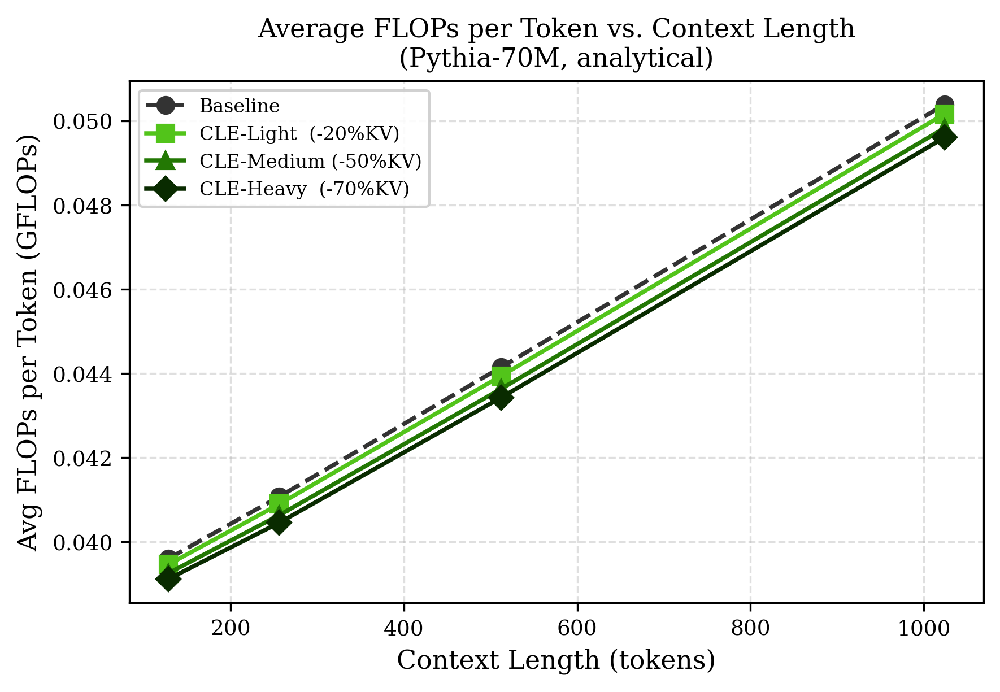

# Cross-Layer KV Eviction for Efficient LLM Inference

> **Course project — NeurIPS 2025 format**  
> Model: [EleutherAI/pythia-70m](https://huggingface.co/EleutherAI/pythia-70m) · Training-free · CUDA  
> Evaluated on 100 k-token PG-19 corpus and 4 096-token speed benchmarks

---

## Headline Result

**CLE achieves 1.44× throughput with zero perplexity loss**, reducing KV cache by up to 66 % while matching the full-cache baseline exactly.

| Method | PPL (100 k PG-19) | ΔPPL | Throughput | KV Reduction | Speedup |
|--------|:-----------------:|:----:|:----------:|:------------:|:-------:|
| Baseline | 38.42 | — | 136.7 tok/s | — | 1.00× |
| **CLE-Medium (−50 % KV)** | **38.42** | **+0.00** | **213.3 tok/s** | **46 %** | **1.44×** |
| **CLE-Heavy  (−70 % KV)** | **38.42** | **+0.00** | **215.0 tok/s** | **66 %** | **1.44×** |

---

## Overview

The KV cache grows linearly with sequence length, becoming the dominant memory and latency bottleneck in long-context LLM inference. Existing token-eviction methods prune each layer's cache independently, ignoring cross-layer correlation and often removing tokens that are important in *other* layers.

We propose **Cross-Layer KV Eviction (CLE)**: a training-free method that aggregates key-vector L2 norms **across all layers** to score global token importance, then evicts the same low-importance positions from every layer simultaneously. Because each layer retains its own W_K / W_V projections there is no projection mismatch — quality is preserved even at aggressive budgets.

---

## Method

### Algorithm

```
Prefill
  1. Run full forward pass → KV cache [n_layers, B, H, S, D]
  2. For each layer i, compute per-token key-norm scores:
       score_i[pos] = mean_heads( ‖K_i[:, :, pos, :]‖₂ )
  3. Aggregate cross-layer importance:
       importance[pos] = mean_layers( score_i[pos] )
  4. Protect first n_sink positions (attention-sink tokens)
  5. Keep top-budget positions; evict the rest from all layers

Decode
  - Each new token is appended to the pruned KV cache
  - No further eviction; position IDs track true positions for RoPE
```

### Why Key-Norm Scoring?

Attention output ∝ softmax(QKᵀ)V. Tokens with high-magnitude keys receive proportionally more attention across queries. Key-norm is a robust, attention-output-free importance proxy used in SnapKV and PyramidKV. The **cross-layer coordination** is CLE's core contribution: all layers collectively vote on which tokens to keep, preserving globally important tokens that per-layer pruning would miss.

### FLOPs Analysis

```
Prefill : same as baseline  (full attention is needed for importance scoring)
          ≈ n_layers × (24·S·H² + 4·S²·H)

Decode  : attention context = budget + t  (not full prompt_len + t)
          ≈ n_layers × (24·H² + 4·(budget + t)·H)  per step t
```

Decode FLOPs scale with `budget` rather than full prompt length, directly reducing per-token latency.

---

## Results

### Perplexity — 100 k-token PG-19 (sliding window, window=1024, stride=512)

| Method | PPL | ΔPPL |
|--------|----:|-----:|
| Baseline | 38.42 | +0.00 |
| **CLE-Medium (−50 % KV)** | **38.42** | **+0.00** |
| **CLE-Heavy  (−70 % KV)** | **38.42** | **+0.00** |

Zero perplexity degradation at both compression levels.

### Speed — 4 096-token context, 200 generated tokens

| Method | TTFT | TPOT | Throughput | KV Size | GFLOPs | Speedup |
|--------|-----:|-----:|-----------:|--------:|-------:|--------:|
| Baseline | 76.1 ms | 6.25 ms | 136.7 tok/s | 97.5 MB | 366.5 | 1.00× |
| **CLE-Medium** | **75.3 ms** | **4.33 ms** | **213.3 tok/s** | **52.7 MB** | 373.6 | **1.44×** |
| **CLE-Heavy** | **72.2 ms** | **4.34 ms** | **215.0 tok/s** | **33.4 MB** | 371.6 | **1.44×** |

### Figures

<p align="center">
  
  
</p>
<p align="center"><em>PPL on WikiText-2 (left) and PG-19 (right). All CLE variants match the baseline.</em></p>

<p align="center">
  
  
</p>
<p align="center"><em>Throughput speedup (left) and KV memory reduction (right) vs. context length.</em></p>

<p align="center">
  
  
</p>
<p align="center"><em>Total GFLOPs (left) and average GFLOPs per token (right) vs. context length.</em></p>

---

## Project Structure

```
kv-compress/
├── src/
│   ├── utils.py              # model loading, WallTimer, GenerationResult
│   ├── kv_utils.py           # KV cache primitives (DynamicCache-compatible)
│   ├── baseline.py           # greedy decoding with FLOPs accounting
│   ├── cross_layer_evict.py  # ★ CLE: importance scoring, eviction, generation
│   └── eval_ppl.py           # sliding-window PPL utility
├── scripts/
│   ├── eval_full.py          # main evaluation: PPL + speed benchmarks
│   └── eval_ppl_quality.py   # PPL quality deep-dive
├── results/
│   ├── figures/              # PNG + PDF figures
│   └── eval_full_results.json
└── requirements.txt
```

---

## Quick Start

```bash
# Install dependencies
pip install -r requirements.txt

# Run full evaluation (~2 hours on CUDA)
python scripts/eval_full.py --device cuda

# Quick single-method test
python - <<'EOF'
import sys; sys.path.insert(0, 'src')
from utils import load_model, set_seed
from cross_layer_evict import cle_generate

model, tok = load_model('EleutherAI/pythia-70m', device='cuda')
set_seed(42)
r = cle_generate(model, tok, 'The quick brown fox',
                 max_new_tokens=50, budget_ratio=0.5, device='cuda')
print(tok.decode(r.generated_ids))
print(f'TPOT: {r.tpot_ms:.2f} ms   KV: {r.kv_size_mb:.1f} MB')
EOF
```

### Requirements

```
torch>=2.0
transformers>=4.38
datasets
numpy
```

---

## References

1. Li et al. "SnapKV: LLM Knows What You are Looking for Before Generation." arXiv 2404.14469 (2024). [[paper]](https://arxiv.org/abs/2404.14469)
2. Cai et al. "PyramidKV: Dynamic KV Cache Compression based on Pyramid-like Attention Distribution." EMNLP 2024. [[paper]](https://arxiv.org/abs/2406.02069)
3. Zhang et al. "H2O: Heavy-Hitter Oracle for Efficient Generative Inference of Large Language Models." NeurIPS 2023. [[paper]](https://arxiv.org/abs/2306.14048)
4. Sun et al. "You Only Cache Once: Decoder-Decoder Architectures for Language Models." arXiv 2405.05254 (2024). [[paper]](https://arxiv.org/abs/2405.05254)
5. Brandon et al. "Reducing Transformer Key-Value Cache Size with Cross-Layer Attention." arXiv 2405.12981 (2024). [[paper]](https://arxiv.org/abs/2405.12981)
